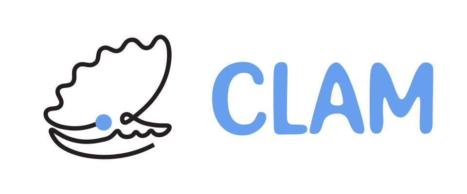

# Home

> The **C**omputational **L**agrangian **A**nalysis and **M**odelling Community ("CLAM Community" or just "CLAM" for short) is a space where researchers and students to exchange ideas and discuss research in Lagrangian Modelling and Analysis. Most of our expertise is in Ocean science - but we'd love to have you as part of the community if you have different expertise!

[Join us on Zulip]({{ zulip_url }}){ .md-button target="\_blank" }
[Code of Conduct](./code-of-conduct.md){ .md-button target="\_blank" }

## What is Zulip?

!!! note
    
    New to Zulip? The best way to discover it is just to have a
    poke around the space! Introduce
    yourself, message in the `sandbox` channel to test out
    the messaging syntax, or read the ["Getting Started" documentation](https://zulip.com/help/getting-started-with-zulip).

Zulip is an online platform that we use for the CLAM Community. It is similar to Slack or Discord, but has the following benefits:

- **Rich messaging syntax**: Messaging on Zulip has support for LaTeX, code blocks, polls, and more.
- **Feature rich**: Zulip provides many integrations with other services, allowing us to easily set up video conferencing or integrate with 3rd party platforms like GitHub
- **Value aligned**: Zulip is open source software, and they have a generous cloud hosting option for academic communities. Zulip is also [GDPR compliant](https://zulip.com/help/gdpr-compliance).

Many communities such as [Conda Forge](https://conda-forge.zulipchat.com/) and [Jupyter](https://jupyter.zulipchat.com) are already on Zulip!

## Governance

The organisation, direction and moderation of CLAM is done by the governance team - which is split into three roles:

- **Steering Council:** These individuals make decision with respect to the direction of the community. They also may moderate conversation in the community according to the community Code of Conduct.
- **Moderators:** These individuals moderate conversation in the community according to the community Code of Conduct.
- **Project Representatives:** These individuals are representatives for the respective projects shown below. They have full control over the channels related to their project. 

!!! note

    This community was formed in 2025 after the [Parcels 10 Year event](https://parcels-code.org/blog/10year-event)
    which made it clear there is a need for such an online space to facilitate
    our science. As a result, the current governance structure has many members 
    of the Parcels team. We value diversity - we would love to have your input  discussing ideas
    to improve the community (e.g., event suggestions, community structure).
    Our hope is that as this space matures that the governance structure can
    become more diverse so that we can promote a wider range of ideas, and 
    be more representative of the community. We aim to raise this at the
    town hall at the Ocean Sciences Meeting in 2026.

### Steering Council

{{render_role_grid('steering')}}

### Moderators

{{render_role_grid('moderators')}}

### Project Representatives

_Projects are listed alphabetically._

#### Parcels

{{render_role_grid('project-parcels')}}

## Contributing

Here is a list of the people who have contributed to the project.

<!-- ALL-CONTRIBUTORS-LIST:START - Do not remove or modify this section -->
<!-- prettier-ignore-start -->
<!-- markdownlint-disable -->
<!-- markdownlint-restore -->
<!-- prettier-ignore-end -->
<!-- ALL-CONTRIBUTORS-LIST:END -->